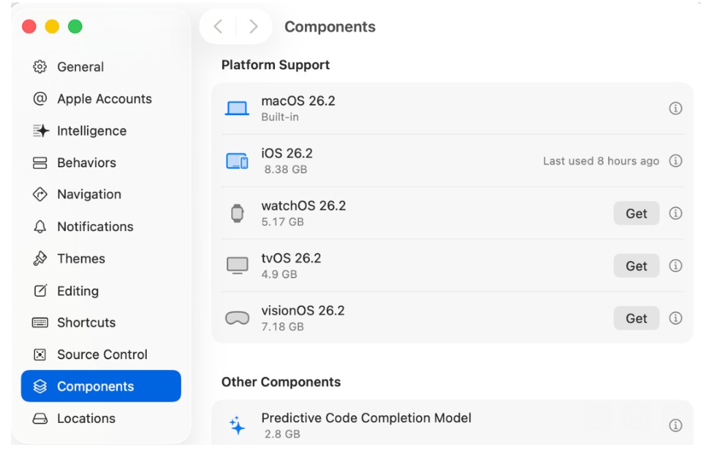

# LumosFit iOS App

This app is built with **React Native** and **Expo**. React Native lets you build native iOS (and Android) apps using JavaScript and React. Expo is a framework and toolchain that simplifies setting up, building, and running React Native projects.

## Claude Code on VS Code / Cursor setup instructions
[Claude Code on VS Code / Cursor setup instructions](https://code.claude.com/docs/en/vs-code)

---

## First-time setup

After you clone or fork the repository and have the code on your machine, run these commands from the project root (the `ios-app-lumosfit` folder):


| Command                            | What it does                                                                                                                                                                                                                                                  |
| ---------------------------------- | ------------------------------------------------------------------------------------------------------------------------------------------------------------------------------------------------------------------------------------------------------------- |
| `npm install`                      | Installs project dependencies (Node modules).                                                                                                                                                                                                                 |
| `npx expo install expo-dev-client` | Installs the Expo dev client so you can run development builds on simulator or device. A *development build* is a build of your app that includes Expo's developer tools and loads your JavaScript from the dev server so you get fast refresh and debugging. |


**Optional:** [Watchman](https://facebook.github.io/watchman/docs/install#macos) can improve performance when files change. On macOS with Homebrew:

```bash
brew install watchman
```

*Installs Watchman for faster file watching.*

---

## Get started

1. **Install dependencies**
  ```bash
   npm install
  ```
   *Installs project dependencies (Node modules).*

2. **Start the app**
  ```bash
   npx expo start
  ```
   *Starts the Expo dev server—a local server that serves your JavaScript bundle so code changes can appear with fast refresh without rebuilding the native app.*
   In the output, you'll find options to open the app in a:
  - [development build](https://docs.expo.dev/develop/development-builds/introduction/)
  - [Android emulator](https://docs.expo.dev/workflow/android-studio-emulator/)
  - [iOS simulator](https://docs.expo.dev/workflow/ios-simulator/)
  - [Expo Go](https://expo.dev/go), a limited sandbox for trying out app development with Expo
   You can start developing by editing the files inside the **app** directory. This project uses [file-based routing](https://docs.expo.dev/router/introduction/).

---

## Prerequisites

- **Node.js** (LTS) — [nodejs.org](https://nodejs.org/)
- **macOS** with **Xcode** (for iOS simulator or device)
- **Git** (to clone the repo)

**Note:** The iOS setup and troubleshooting steps in this README are written for **macOS** (required for building and running the app on the iOS Simulator or a physical iPhone).

---

## Two ways to run the app for testing

You can either run the app in the **iOS Simulator** (in Xcode) or on a **physical iPhone** connected to your Mac.

---

### Option 1: iOS Simulator (Xcode)

1. **Install Xcode**
  Install from the [Mac App Store](https://apps.apple.com/us/app/xcode/id497799835) (or update if you already have it).
2. **Install Xcode Command Line Tools**
  Open Xcode → **Settings…** (or ⌘ + ,) → **Locations** → choose the latest version in the **Command Line Tools** dropdown.
3. **Install iOS platform support in Xcode**  
   In Xcode, go to **Settings…** → **Components**. Under **Platform Support**, ensure **iOS** is installed (you should see a version number and size, e.g. "Last used …", not a "Get" button). If you see **Get** next to iOS, click it to download and install the iOS platform.

   

4. **Run the app in the simulator (terminal)**  
   Open the terminal, go to the project root (`ios-app-lumosfit`), then run **one** of these:

   **Option A — Start dev server, then choose iOS:**
   ```bash
   npx expo start
   ```
   That starts the Expo dev server (serves your JavaScript so you get fast refresh). When the dev server is running, the terminal shows a QR code and a menu. Press **`i`** to open the **iOS Simulator**. Expo will launch the simulator and load the app. (You can press `i` again later to reopen the simulator from the same terminal.)

   **Option B — Build and launch in one step:**
   ```bash
   npx expo run:ios
   ```
   That builds the native iOS app and launches it in the default iOS Simulator. If you have more than one simulator, the terminal may ask you to pick one—use the arrow keys to choose, then press Enter. The dev server starts and the simulator opens with the app.

---

### Option 2: Physical iPhone (device)

To run the app on a physical iPhone you need extra setup in Xcode: **sign in with your Apple ID**, add your account in Xcode, and let Xcode create a **development certificate** and provisioning profile. If the terminal build fails with a signing error, **build once from Xcode** with your device selected—that often generates the profile so `npx expo run:ios --device` works afterward.

1. **Complete Option 1 steps 1–3** (Xcode and iOS platform support must be installed).
2. **Connect your iPhone**
  Plug your iPhone into your Mac with a USB cable. Unlock the device and tap **Trust** if your iPhone asks to trust the computer.
3. **Enable Developer Mode on your iPhone**
  - On the iPhone: **Settings** → **Privacy & Security** → **Developer Mode**.
  - Turn **Developer Mode** **On**.
  - Confirm the restart when prompted; after the device restarts, confirm again and enter your passcode if asked.
4. **Set a unique bundle identifier (first time only)**  
   In the project root, open `app.json` and set `expo.ios.bundleIdentifier` to a value unique to you (e.g. `com.yourname.lumosfit`). Xcode uses this to create a provisioning profile so the app can be signed and run on your device.

   **If you forked this repo:** Use a bundle ID that *you* will register with your own Apple Developer account (e.g. `com.forkername.lumosfit`). The bundle ID is tied to a specific Apple Developer account. If you keep the original author's bundle ID, only their account can create valid profiles—you'll get errors like "No profiles for 'com.yourname.lumosfit' were found." Set `expo.ios.bundleIdentifier` in `app.json` to something you'll register, then use your Apple Developer account to register that bundle ID and create the provisioning profile.

5. **Build and run on your device (terminal)**  
   Open the terminal and go to the project root. Run:

   ```bash
   npx expo run:ios --device
   ```

   That command builds the app and lists your connected iOS devices.  

   When prompted, **select your iPhone** from the list (use the arrow keys, then press Enter). Expo will build the app, install it on your phone, and start the dev server. Keep the terminal open so the app can connect to the dev server for fast refresh.
6. **If your iPhone shows "Untrusted Developer"**
  After the app is installed, iOS may block it until you trust your developer certificate:
  - On the iPhone: **Settings** → **VPN & Device Management** (or **General** → **VPN & Device Management** on some versions).
  - Under **Developer App**, tap your developer profile and choose **Allow** (or **Trust "…"**).
   You only need to do this once per device/profile.
7. **Open the app and connect to the dev server**  
   On your iPhone, find the LumosFit app in the home screen or App Library and open it. To load your project from the dev server (for fast refresh and the latest code), the app needs the dev server URL. In the **same terminal** where you ran `npx expo run:ios --device`, a QR code and a URL (e.g. `exp://192.168.x.x:8081`) are shown. Either **scan that QR code** with your iPhone camera (or from inside the app if it has a scanner), or **type the URL** into the app when it asks for a development server URL. Once connected, the app loads your JavaScript from your Mac.

---

## Quick reference: terminal commands


| Command                            | What it does                                                                                                                           |
| ---------------------------------- | -------------------------------------------------------------------------------------------------------------------------------------- |
| `npm install`                      | Install dependencies.                                                                                                                  |
| `npx expo install expo-dev-client` | Add Expo dev client for development builds (a build of your app that includes Expo's dev tools and loads JS from the dev server).      |
| `npx expo run:ios`                 | Build and run on the default iOS Simulator.                                                                                            |
| `npx expo run:ios --device`        | Build and run on a connected iPhone (choose device when prompted).                                                                     |
| `npx expo start`                   | Start the Expo dev server only (serves your JS bundle for fast refresh and debugging; then press `i` for iOS simulator if configured). |


---

## Troubleshooting (macOS / physical device)

These issues commonly appear when building or running on a **physical iPhone** on macOS. Fixes assume you are using Xcode on a Mac.

**1. "Xcode must be fully installed"**  
Xcode or Command Line Tools are not fully set up. Install Command Line Tools: open Xcode → **Settings…** (⌘,) → **Locations** → set **Command Line Tools** to the latest version. Open Xcode once and let it complete any first-run setup.

**2. "No code signing certificates available"**  
There is no Apple Development certificate for your account. First add your Apple ID: Xcode → **Settings…** → **Accounts** → **+** → **Apple ID** → sign in. Then set up signing for this app: in Xcode's **left sidebar** (Project Navigator), click the **blue project icon** at the top (the one with the app name). In the main area you'll see **TARGETS**; click the **app target** (e.g. the name of the app, often under the project). With the app target selected, open the **Signing & Capabilities** tab in the main editor. Turn on **Automatically manage signing** and choose your **Team** in the dropdown (for a free Apple ID this is usually **Personal team**). Xcode will create the development certificate.

**3. Bundle identifier not available (or "already in use")**  
Explanation: that bundle ID is already registered to another Apple Developer account or app. To fix it: go to the **ios** folder in your project and double-click the **.xcworkspace** file to open the project in Xcode (that’s how you get to the targets). In Xcode’s left sidebar (Project Navigator), click the **blue project icon** at the top. In the main area under **TARGETS**, click the **app target**. Open the **Signing & Capabilities** tab and change **Bundle Identifier** to something unique (e.g. `com.yourname.lumosfit`). Also set the same value in `app.json` as `expo.ios.bundleIdentifier`.

**4. "Your team has no devices…"**  
Your iPhone is not registered as a development device for your team. On the iPhone, enable **Developer Mode** (Settings → Privacy & Security → Developer Mode) and, when you connect the cable, tap **Trust** on the device. Reconnect the device to your Mac; Xcode should register it and you can create a provisioning profile.

**5. Expo build failed (e.g. Error 65 / "No profiles for …" / no signing profile)**  
The Expo CLI could not create or use a signing profile. Open the project in Xcode (open the `ios` folder and double-click the `.xcworkspace` file). In the top toolbar, choose your **physical device** (your iPhone by name) as the run destination—not a simulator. Then run from Xcode (**Product** → **Run** or ⌘R). That creates the profile; afterward `npx expo run:ios --device` will usually work.

**6. App didn't show up on the phone**  
The build targeted a simulator instead of your device. In Xcode, use the run-destination dropdown in the top toolbar and select your **actual device** (your iPhone by name), then run again. When using the terminal with `npx expo run:ios --device`, pick your phone from the list, not a simulator.

If you run into other bugs or errors, try searching the exact message online or describing the issue to an AI assistant (e.g. ChatGPT or another LLM) to help debug.

---

## Additional notes

### How React Native and Expo work

Your app logic and UI are written in **JavaScript or TypeScript** (React components). That code is **not** converted to Swift or Objective-C. Instead, it runs as JavaScript inside the app at runtime.

The iOS app you build is a **native binary** (the “shell”) that includes:

- A **JavaScript engine** — on iOS, React Native uses **Hermes**, which executes your JS bundle.
- The **React Native native layer** — C++, Objective-C++, and Swift code that implements the framework. When your React tree says “render a View” or “show this text”, React Native’s native code creates and updates real iOS views (`UIView`, `UILabel`, etc.) and handles touch, layout, and native APIs. Communication between JavaScript and this native layer goes through the **bridge** (or, in the new architecture, **JSI** — JavaScript Interface).

So: your code stays JavaScript; the native app is a host that runs that JavaScript and turns your React description into real native UI and behavior.

**Expo** adds tooling (CLI, config, dev server) and a set of **native modules** (camera, sensors, etc.) that are already wired into the native project. When you run Expo commands, Expo uses the same React Native native layer and builds the same kind of native shell, with Expo’s modules and config applied.

### What gets compiled

- **JavaScript side:** **Metro** (the bundler) takes your source files, resolves `import`s, and produces a **JavaScript bundle**. That bundle is not compiled to machine code; it is loaded and executed at runtime by Hermes. In development, the bundle is served by the dev server; in a production build, it can be embedded in the app or loaded from a server.

- **Native side:** The `ios/` project contains the React Native framework, Hermes, and your app’s native shell (and any native modules). **Xcode** compiles this:
  - **clang** compiles C, C++, and Objective-C/C++.
  - The **Swift compiler** (`swiftc`) compiles Swift.

  The result is native **machine code** (ARM for a physical device, or x86_64/arm64 for the simulator) packaged as the `.app`. When you launch the app, that native binary starts Hermes, loads your JavaScript bundle, and React Native’s native layer renders the UI and handles events according to what your JS code describes.

---

## Useful links

- [Create an Expo project](https://docs.expo.dev/get-started/create-a-project/)
- [Set up your environment (iOS, physical device, development build, local)](https://docs.expo.dev/get-started/set-up-your-environment/?platform=ios&device=physical&mode=development-build&buildEnv=local)

